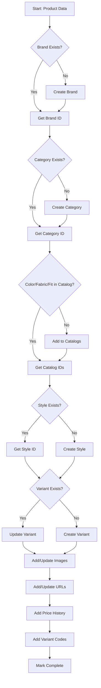

# Product Ingestion Framework

A comprehensive guide for adding garments to the FreestyleDB product catalog. This document serves as a framework for automated agents or manual data entry processes.

---

## Table of Contents

1. [Overview](#overview)
2. [Data Model](#data-model)
3. [Ingestion Process](#ingestion-process)
4. [Step-by-Step Instructions](#step-by-step-instructions)
5. [Validation Rules](#validation-rules)
6. [Example SQL Workflows](#example-sql-workflows)
7. [Troubleshooting](#troubleshooting)

---

## Overview

### Purpose
This framework defines the complete process for ingesting a new garment into FreestyleDB, ensuring data consistency, referential integrity, and proper tracking.

### Key Principles
- **Idempotency**: Running the same ingestion twice should not create duplicates
- **Atomicity**: All related data for a product should be ingested together
- **Traceability**: Track when and how data was added
- **Normalization**: Reuse existing catalog entries (brands, colors, etc.)

---

## Data Model

### Entity Hierarchy

```
brand (e.g., "Everlane")
  ↓
category (e.g., "Shirts")
  ↓
style (base product, e.g., "Voyager Travel Shirt")
  ↓
variant (color variation, e.g., "Navy" version)
  ↓
[variant_code, product_image, product_url, price_history]
```

### Core Tables

| Table | Purpose | Required Fields |
|-------|---------|----------------|
| `brand` | Brand/retailer information | `name` |
| `category` | Product categories (shirts, pants, etc.) | `slug`, `name` |
| `style` | The base product (unique per brand+name) | `name`, `brand_id` |
| `variant` | Color/fit variations of a style | `style_id` |
| `color_catalog` | Normalized color names | `canonical` |
| `fabric_catalog` | Fabric types | `name` |
| `fit_catalog` | Fit types (slim, regular, relaxed) | `name` |

### Supporting Tables

| Table | Purpose | Links To |
|-------|---------|----------|
| `product_image` | Product photos | `style_id`, `variant_id` |
| `product_url` | Web URLs (retailer pages) | `style_id`, `variant_id` |
| `price_history` | Price tracking over time | `variant_id` |
| `variant_code` | SKUs, UPCs, GTINs | `variant_id` |

### Tracking Tables

| Table | Purpose |
|-------|---------|
| `ingestion_job` | Queue for processing products |
| `ingest_run` | Log of completed ingestion batches |

---

## Ingestion Process

### High-Level Flow



---

## Step-by-Step Instructions

### Step 0: Prepare Source Data

**Required Input:**
```json
{
  "brand_name": "Everlane",
  "brand_website": "https://everlane.com",
  "category": "shirts",
  "product_name": "The Performance Oxford Shirt",
  "description": "A breathable, wrinkle-resistant shirt...",
  "gender": "mens",
  "color": "Navy",
  "color_family": "Blue",
  "fabric": "100% Cotton Oxford",
  "fit": "Regular",
  "size_scale": "US-MENS-ALPHA", // or "US-MENS-NUMERIC", etc.
  "region": "US",
  "product_url": "https://everlane.com/products/...",
  "images": [
    {"url": "https://...", "position": 0, "is_primary": true},
    {"url": "https://...", "position": 1}
  ],
  "price": {
    "list_price": 78.00,
    "sale_price": null,
    "currency": "USD"
  },
  "codes": [
    {"type": "SKU", "code": "EVL-OX-NAV-M"},
    {"type": "UPC", "code": "123456789012"}
  ]
}
```

---

### Step 1: Resolve or Create Brand

**Check if brand exists:**
```sql
SELECT id FROM brand WHERE name = 'Everlane';
```

**If not found, create:**
```sql
INSERT INTO brand (name, website)
VALUES ('Everlane', 'https://everlane.com')
RETURNING id;
```

**Store:** `brand_id`

---

### Step 2: Resolve or Create Category

**Check if category exists:**
```sql
SELECT id FROM category WHERE slug = 'shirts';
```

**If not found, create:**
```sql
INSERT INTO category (slug, name, parent_id)
VALUES ('shirts', 'Shirts', NULL)
RETURNING id;
```

**Note:** For subcategories (e.g., "dress-shirts" under "shirts"), set `parent_id`.

**Store:** `category_id`

---

### Step 3: Resolve or Create Catalog Entries

#### 3a. Color Catalog

**Check if color exists:**
```sql
SELECT id FROM color_catalog WHERE canonical = 'Navy';
```

**If not found, create:**
```sql
INSERT INTO color_catalog (canonical, family, hex)
VALUES ('Navy', 'Blue', '#001f3f')
RETURNING id;
```

**Store:** `color_id`

#### 3b. Fabric Catalog

**Check if fabric exists:**
```sql
SELECT id FROM fabric_catalog WHERE name = '100% Cotton Oxford';
```

**If not found, create:**
```sql
INSERT INTO fabric_catalog (name, composition)
VALUES ('100% Cotton Oxford', '100% Cotton')
RETURNING id;
```

**Store:** `fabric_id` (optional)

#### 3c. Fit Catalog

**Check if fit exists:**
```sql
SELECT id FROM fit_catalog WHERE name = 'Regular';
```

**If not found, create:**
```sql
INSERT INTO fit_catalog (name)
VALUES ('Regular')
RETURNING id;
```

**Store:** `fit_id` (optional)

---

### Step 4: Resolve or Create Style

**Check if style exists:**
```sql
SELECT id FROM style
WHERE brand_id = <brand_id>
  AND name = 'The Performance Oxford Shirt'
  AND category_id = <category_id>;
```

**Note:** The combination of `(brand_id, name, category_id)` is unique.

**If not found, create:**
```sql
INSERT INTO style (brand_id, category_id, name, description, gender, lifecycle)
VALUES (
  <brand_id>,
  <category_id>,
  'The Performance Oxford Shirt',
  'A breathable, wrinkle-resistant shirt...',
  'mens',
  'active'
)
RETURNING id;
```

**Store:** `style_id`

---

### Step 5: Resolve or Create Variant

**Check if variant exists:**
```sql
SELECT id FROM variant
WHERE style_id = <style_id>
  AND color_id = <color_id>
  AND fit_id = <fit_id>
  AND fabric_id = <fabric_id>;
```

**If not found, create:**
```sql
INSERT INTO variant (style_id, color_id, fit_id, fabric_id, size_scale, is_active, attrs)
VALUES (
  <style_id>,
  <color_id>,
  <fit_id>,
  <fabric_id>,
  'US-MENS-ALPHA',
  true,
  '{}'::jsonb
)
RETURNING id;
```

**If found, optionally update:**
```sql
UPDATE variant
SET is_active = true,
    size_scale = 'US-MENS-ALPHA'
WHERE id = <variant_id>;
```

**Store:** `variant_id`

---

### Step 6: Add Product Images

**For each image in the input:**

```sql
INSERT INTO product_image (
  style_id,
  variant_id,
  region,
  url,
  position,
  is_primary,
  color_code,
  alt,
  source,
  captured_at
)
VALUES (
  <style_id>,
  <variant_id>,
  'US',
  'https://cdn.example.com/image.jpg',
  0,
  true,
  NULL,
  'Navy Oxford Shirt - Front View',
  'scrape',
  NOW()
)
ON CONFLICT (style_id, variant_id, url) DO UPDATE
SET position = EXCLUDED.position,
    is_primary = EXCLUDED.is_primary,
    captured_at = NOW();
```

**Key Points:**
- The combination `(style_id, variant_id, url)` is unique
- Use `ON CONFLICT` to update if image already exists
- `is_primary = true` should be set for the main product photo

---

### Step 7: Add Product URLs

**For the main product page:**

```sql
INSERT INTO product_url (
  style_id,
  variant_id,
  region,
  url,
  is_current,
  seen_at
)
VALUES (
  <style_id>,
  <variant_id>,
  'US',
  'https://everlane.com/products/mens-performance-oxford-navy',
  true,
  NOW()
)
ON CONFLICT (url) DO UPDATE
SET is_current = true,
    seen_at = NOW();
```

**Key Points:**
- URLs can be at the style level (if variant-agnostic) or variant level
- `is_current = true` means the URL is active
- Old URLs should be marked `is_current = false` (not deleted)

---

### Step 8: Add Price History

**Record the current price:**

```sql
INSERT INTO price_history (
  variant_id,
  region,
  currency,
  list_price,
  sale_price,
  captured_at
)
VALUES (
  <variant_id>,
  'US',
  'USD',
  78.00,
  NULL,
  NOW()
)
ON CONFLICT (variant_id, region, captured_at) DO NOTHING;
```

**Key Points:**
- This creates a time-series of prices
- `sale_price` should be NULL if no discount
- The combination `(variant_id, region, captured_at)` is unique

---

### Step 9: Add Variant Codes (SKUs, UPCs, etc.)

**For each code in the input:**

```sql
INSERT INTO variant_code (
  variant_id,
  code,
  code_type,
  region
)
VALUES (
  <variant_id>,
  'EVL-OX-NAV-M',
  'SKU',
  'US'
)
ON CONFLICT (variant_id, code_type, region) DO UPDATE
SET code = EXCLUDED.code;
```

**Key Points:**
- `code_type` examples: `SKU`, `UPC`, `GTIN`, `EAN`, `ASIN`
- Use `region = 'ALL'` for globally unique codes (UPCs, GTINs)
- Use specific regions for retailer-specific codes (SKUs)

---

### Step 10: Log Ingestion

**Optional: Track the ingestion run:**

```sql
INSERT INTO ingest_run (brand_id, source, notes)
VALUES (
  <brand_id>,
  'agent_v1',
  'Ingested via automated agent'
)
RETURNING id;
```

**Update at completion:**

```sql
UPDATE ingest_run
SET finished_at = NOW()
WHERE id = <run_id>;
```

---

## Validation Rules

### Pre-Ingestion Checks

| Check | Rule | Action if Failed |
|-------|------|------------------|
| Brand name | Non-empty string | Reject |
| Product name | Non-empty string | Reject |
| Category | Valid slug format | Reject |
| Color | Non-empty string | Create in catalog |
| Product URL | Valid HTTP(S) URL | Warn, continue |
| Image URLs | Valid HTTP(S) URLs | Warn, skip invalid |
| Price | Positive number | Reject |
| Currency | ISO 4217 code (USD, EUR, etc.) | Reject |

### Post-Ingestion Checks

| Check | Query | Expected Result |
|-------|-------|-----------------|
| Style created | `SELECT id FROM style WHERE id = <style_id>` | 1 row |
| Variant created | `SELECT id FROM variant WHERE id = <variant_id>` | 1 row |
| Images added | `SELECT COUNT(*) FROM product_image WHERE variant_id = <variant_id>` | ≥ 1 |
| URL added | `SELECT COUNT(*) FROM product_url WHERE variant_id = <variant_id>` | ≥ 1 |
| Price recorded | `SELECT COUNT(*) FROM price_history WHERE variant_id = <variant_id>` | ≥ 1 |

---

## Example SQL Workflows

### Complete Ingestion (Single Transaction)

```sql
BEGIN;

-- 1. Brand
INSERT INTO brand (name, website) VALUES ('Everlane', 'https://everlane.com')
ON CONFLICT (name) DO UPDATE SET website = EXCLUDED.website
RETURNING id INTO brand_id;

-- 2. Category
INSERT INTO category (slug, name) VALUES ('shirts', 'Shirts')
ON CONFLICT (slug) DO UPDATE SET name = EXCLUDED.name
RETURNING id INTO category_id;

-- 3. Color
INSERT INTO color_catalog (canonical, family) VALUES ('Navy', 'Blue')
ON CONFLICT (canonical) DO NOTHING
RETURNING id INTO color_id;

-- 4. Style
INSERT INTO style (brand_id, category_id, name, description, gender)
VALUES (brand_id, category_id, 'Performance Oxford', 'Wrinkle-resistant...', 'mens')
ON CONFLICT (brand_id, name, category_id) DO UPDATE
SET description = EXCLUDED.description
RETURNING id INTO style_id;

-- 5. Variant
INSERT INTO variant (style_id, color_id, size_scale)
VALUES (style_id, color_id, 'US-MENS-ALPHA')
RETURNING id INTO variant_id;

-- 6. Images
INSERT INTO product_image (style_id, variant_id, url, position, is_primary)
VALUES (style_id, variant_id, 'https://...', 0, true)
ON CONFLICT (style_id, variant_id, url) DO UPDATE
SET position = EXCLUDED.position;

-- 7. URL
INSERT INTO product_url (style_id, variant_id, url, region)
VALUES (style_id, variant_id, 'https://everlane.com/...', 'US');

-- 8. Price
INSERT INTO price_history (variant_id, region, currency, list_price, captured_at)
VALUES (variant_id, 'US', 'USD', 78.00, NOW());

COMMIT;
```

### Check for Duplicates Before Inserting

```sql
-- Check if this exact product already exists
SELECT v.id as variant_id
FROM variant v
JOIN style s ON v.style_id = s.id
JOIN brand b ON s.brand_id = b.id
JOIN color_catalog c ON v.color_id = c.id
WHERE b.name = 'Everlane'
  AND s.name = 'Performance Oxford'
  AND c.canonical = 'Navy';

-- If found: update is_active, add new price/image
-- If not found: proceed with full ingestion
```

### Update Existing Product (Price Change)

```sql
-- Find variant by URL
SELECT variant_id FROM product_url
WHERE url = 'https://everlane.com/products/...'
  AND is_current = true
LIMIT 1;

-- Add new price record
INSERT INTO price_history (variant_id, region, currency, list_price, captured_at)
VALUES (<variant_id>, 'US', 'USD', 68.00, NOW());
```

---

## Troubleshooting

### Common Issues

#### Issue: Duplicate variants created
**Cause:** Not checking for existing variant before insert  
**Fix:** Use the lookup query in Step 5 before creating variant

#### Issue: Foreign key constraint violations
**Cause:** Inserting child records before parent records  
**Fix:** Follow the order: brand → category → catalogs → style → variant → images/urls/prices

#### Issue: Image URLs not displaying
**Cause:** Invalid URLs or CORS issues  
**Fix:** Validate URLs with `HEAD` request before insertion

#### Issue: Price history gaps
**Cause:** Not capturing prices regularly  
**Fix:** Set up scheduled price scraping (daily/weekly)

### Debug Queries

**Find products missing images:**
```sql
SELECT v.id, s.name, c.canonical as color
FROM variant v
JOIN style s ON v.style_id = s.id
LEFT JOIN color_catalog c ON v.color_id = c.id
LEFT JOIN product_image pi ON v.id = pi.variant_id
WHERE pi.id IS NULL;
```

**Find products missing URLs:**
```sql
SELECT v.id, s.name
FROM variant v
JOIN style s ON v.style_id = s.id
LEFT JOIN product_url pu ON v.id = pu.variant_id
WHERE pu.id IS NULL;
```

**Find products with stale prices (older than 30 days):**
```sql
SELECT v.id, s.name, MAX(ph.captured_at) as last_price_update
FROM variant v
JOIN style s ON v.style_id = s.id
LEFT JOIN price_history ph ON v.id = ph.variant_id
GROUP BY v.id, s.name
HAVING MAX(ph.captured_at) < NOW() - INTERVAL '30 days'
   OR MAX(ph.captured_at) IS NULL;
```

---

## Agent Implementation Checklist

For an autonomous agent implementing this framework:

- [ ] Input validation (schema validation)
- [ ] Database connection handling (retries, timeouts)
- [ ] Transaction management (rollback on error)
- [ ] Duplicate detection (check before insert)
- [ ] Error logging (track failures)
- [ ] Rate limiting (if scraping from websites)
- [ ] Image validation (check URLs are accessible)
- [ ] Price normalization (handle different formats: $78, 78.00, etc.)
- [ ] Color normalization (map "dark blue" → "Navy")
- [ ] Size scale mapping (standardize across brands)
- [ ] Progress tracking (ingestion_job table)
- [ ] Idempotency (safe to re-run)
- [ ] Dry-run mode (validate without committing)
- [ ] Reporting (summary of items added/updated/skipped)

---

## Next Steps

1. **Data Sources**: Define where products will be ingested from (web scraping, API, CSV, etc.)
2. **Enrichment**: Add size measurements, care instructions, sustainability data
3. **Quality Control**: Implement review process for agent-ingested data
4. **Scaling**: Add batch processing, parallel ingestion
5. **Monitoring**: Track ingestion rates, error rates, data quality metrics

---

## Related Documentation

- [Database Connection Guide](./DATABASE_CONNECTION_GUIDE.md)
- [Design System](./design-system/)
- [Sandbox Lane Implementation](./README.md)

---

**Last Updated:** October 12, 2025  
**Version:** 1.0

